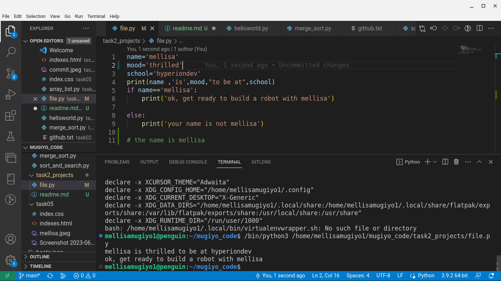
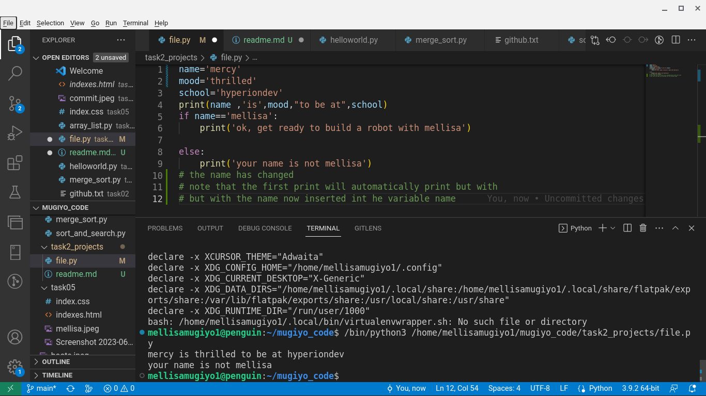
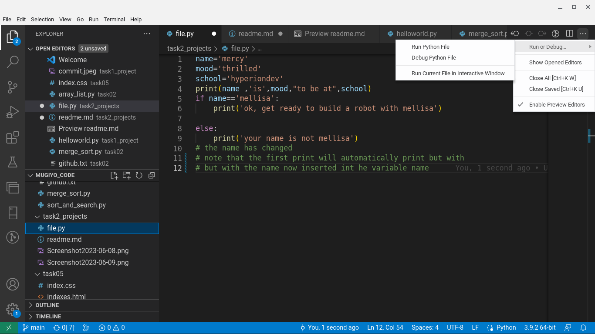

# task2_project

Table of contents

|content
   
          
|introduction

|Discussion  

|   code analysis
|    code present
|    installation 
|    usage

|Result      
   code results
    

introuduction

***

Welcome to file.py
---
---
Inside the file named file.py contains variables and 
a print statement including the variables.
It also include a block of an If statement.

-----------------
-----------------
Discussion
----------
Variables and the If block
***
three variables are found inside the file as placeholders of certain
characters that are going to printed in the final print statement, you can change the values in each variable. The importance of this project is that it is not constant , you can change the values in the variables anytime you want and to anything you want
***
An if statement was included, this block shows that if the variable name equates the name'mellisa' print  'ok!! let's get ready to build a robot with mellisa but if the variable 'name' is no longer mellisa it should print that 'your name is not mellisa. You should note that the first print statement will print no matter what because it is outside the block . even if the name variable changes that print statement will print eitherway but in this case with the value of the name that you inserted
***

code represent
-------------

installation
------------
*dowload visual studio code in your local machine
* navigate inside any folder you want to work on 
* then start working

usage
------
very easy and simple to use , inside your visual studio code , when you are done with your code ,click on the run button ,found in the right upper top inside your code editor and it will show youthe result

Results
-------
Code results 

from the above analysis it shows that no matter what the first print will always print even if you change the values in the variables , it will still print but with the values that you included

